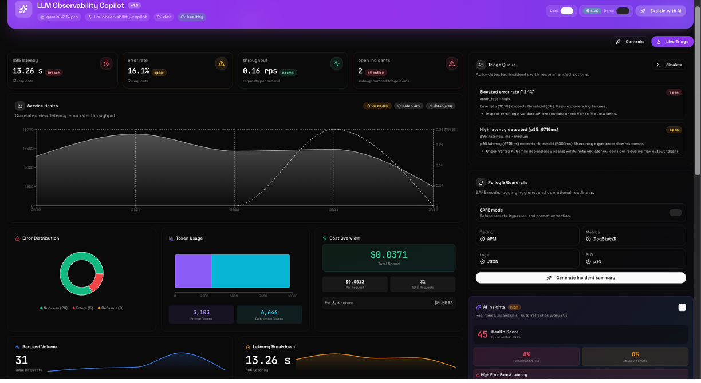
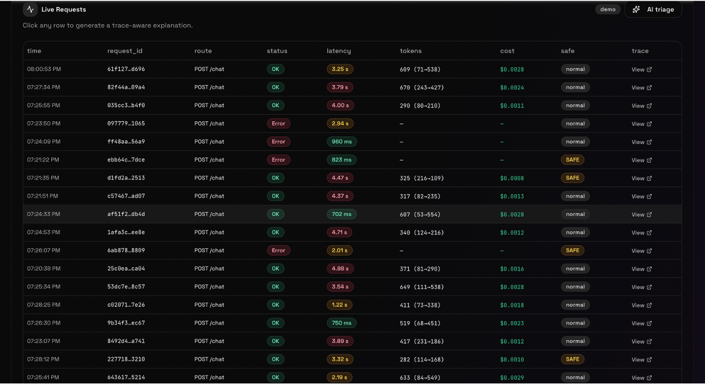
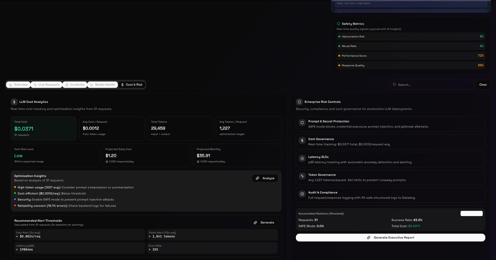
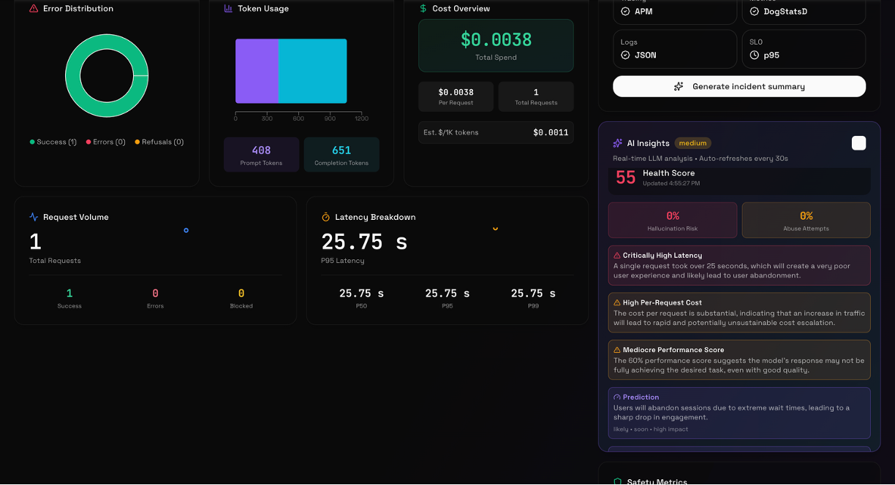

# Tracevox – Open Source LLM Observability

[](LICENSE)
[](https://fastapi.tiangolo.com/)
[](https://vitejs.dev/)
[](https://github.com/omuili/tracevox-core)

Tracevox is an **open‑source LLM observability platform** for monitoring, debugging, and optimizing production AI applications.

- **Backend**: FastAPI service (`main.py`) with a proxy gateway, analytics, alerts, evaluations, and datasets.
- **Frontend**: React + Vite dashboard in `frontend/` (deployed to Vercel).
- **License**: Apache 2.0 (see `LICENSE`).

The code in this repository is the **open‑source core** of Tracevox. A separate, private repository contains additional enterprise extensions.

---

## Features

- **LLM Proxy Gateway**
  - OpenAI‑compatible gateway (`/v1/chat/completions`, Anthropic, Gemini, etc.).
  - Centralized logging of prompts, responses, costs, latency, and errors.

- **Analytics & Dashboards**
  - Usage and cost analytics by model, endpoint, user, and time.
  - Performance breakdowns (latency, error rates).
  - Custom dashboards and saved views.

- **Tracing & Debugging**
  - Request/trace visualizations across steps (retrieval, tools, model, post‑processing).
  - AI‑assisted triage endpoint (`/chat`) to help find root causes and suggested fixes.

- **Alerts & Notifications**
  - Threshold‑based alerts (cost, error rate, latency).
  - Email/Slack style notifications (via Resend + webhooks in the backend).

- **Teams & Billing (for hosted Cloud)**
  - Team management, roles, and invitations.
  - Stripe‑based billing and plans for **Tracevox Cloud**.

> **Note:** The **billing and pricing UI** in this repo describes the **hosted Tracevox Cloud** offering.  
> When you self‑host the open‑source core, you control your own infra and can keep or remove those pages as you like.

---

## Screenshots

Rendered from the demo data included in this repository:






---

## Open Source vs Cloud / Enterprise

Tracevox is developed with a **dual model**:

- **Open‑Source Core (this repo)**
  - Apache‑licensed backend (`app/`, `main.py`) and frontend (`frontend/`).
  - Includes gateway, dashboards, tracing, evaluations, alerts, and a basic multi‑tenant model.
  - Contains integration points for authentication, billing, and SSO so you can run a full product yourself.

- **Tracevox Cloud / Enterprise (private)**
  - Production‑grade, fully managed hosting.
  - Additional security, compliance, and operational features.
  - Dedicated support and SLAs.
  - Additional extensions (e.g. advanced security & compliance) that are not part of this open‑source core.

---

## Quickstart – Local Development

### 1. Backend (FastAPI + Uvicorn)

Create a virtual environment and install dependencies:

```bash
python -m venv .venv
source .venv/bin/activate  # Windows: .venv\Scripts\activate

pip install -r requirements.txt
```

Set minimal environment variables (copy `env.example.txt` → `.env` and adjust as needed), then run:

```bash
export ENV=development
uvicorn main:app --reload --port 8000
```

The API will be available at `http://localhost:8000`.

### 2. Frontend (React + Vite)

From the `frontend/` directory:

```bash
cd frontend
npm install
npm run dev
```

By default, Vite runs on `http://localhost:5173`. In development, the frontend talks to the API via `VITE_API_BASE_URL` (set in a `.env` file in `frontend/` if needed).

---

## Contributing

Contributions are welcome:

1. Fork the repository.
2. Create a feature branch: `git checkout -b feature/my-change`.
3. Run tests / linting locally.
4. Open a pull request with a clear description and screenshots where relevant.

---

## License

Tracevox core is licensed under the **Apache License 2.0**.  
See the `LICENSE` file for details.

